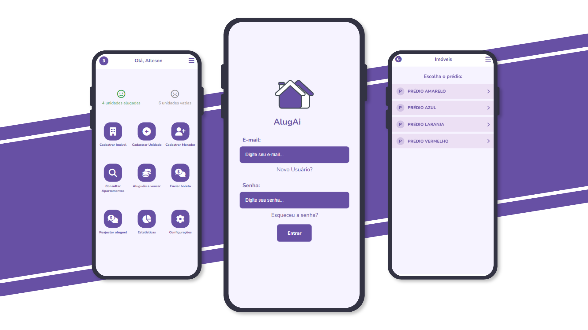
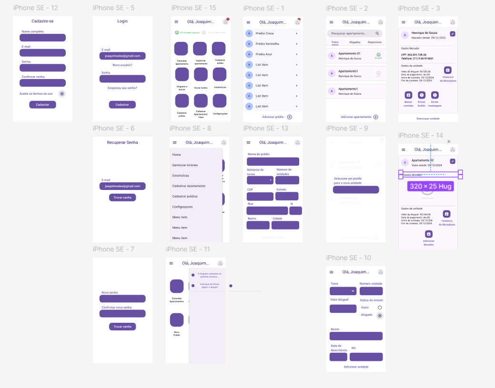

# AlugAi

AlugAi é um aplicativo PWA (Progressive Web App) para gestão de aluguéis, desenvolvido para que proprietários e administradores de imóveis possam gerenciar contratos, unidades, moradores e pagamentos de forma prática e eficiente. Com ele, é possível acompanhar a receita de cada imóvel, receber notificações de vencimentos próximos e gerar contratos automaticamente.

O projeto surgiu para solucionar um problema real: facilitar a gestão dos apartamentos de aluguel da minha família, tornando o controle financeiro e administrativo mais simples e organizado.

Acessar: [Protótipo-Figma](https://www.figma.com/proto/mQrRyC6pyGmUaRNn8OqoSF/Untitled?node-id=1-2&t=bZ73T1F2QBSgqHsz-0&scaling=scale-down&content-scaling=fixed&page-id=0%3A1&starting-point-node-id=15%3A1109)

## Problemática

Meu pai, no auge dos seus 70 anos, enfrentava alguns desafios na gestão de seus aluguéis. Criar contratos para cada novo inquilino e controlar os pagamentos era cada vez mais complicado, especialmente com computadores antigos em casa. Pensando em simplificar esse processo e oferecer uma solução prática, surgiu a ideia de criar um aplicativo que não apenas gerasse contratos, mas também permitisse a gestão completa dos aluguéis. Assim nasceu o AlugAi.

## Funcionalidades

✅ Registro de pagamentos de aluguel

✅ Cadastro de imóveis, unidades e moradores

✅ Busca de endereço automaticamente

✅ Histórico de moradores antigos

✅ Geração automática de contratos

✅ Envio de mensagens via aplicativo para moradores

✅ Controle da receita: valor recebido em aluguéis e valores perdidos por unidades desocupadas

✅ Notificações de aluguéis e contratos próximos do vencimento

✅ Reajuste automático de aluguéis

## Tecnologias Utilizadas

### Frontend:

- HTML
- CSS
- Typescript
- Angular
- Angular Animations

### Backend:

- Node.js
- Express
- JWT
- Cookie-parser
- Estrutura MVC (Programação Orientada a Objetos)

### Banco de Dados:

- SQL
- DBEaver
- Sequelize (com práticas para evitar injeção de SQL)

### Próximos passos

- Integrar a geração de boleto com a API do mercado pago
- Atualizar automaticamente os pagamentos
- Permitir o login com conta google

## Acesse o aplicativo em:

- [Projeto](https://allesonsales.github.io/alugai)
- [Backend](https://github.com/allesonsales/AlugAi-BE)

## Redes sociais:

[LinkedIn](https://www.linkedin.com/in/allesonsales/)

---

### Instalação

### Clonar o repositório

git clone https://github.com/seu-usuario/alugai.git

### Instalar dependências no backend

cd alugai/backend
npm install

### Instalar dependências no frontend

cd ../frontend
npm install

### Como Usar

### Inicie o backend:

npm run start

### Inicie o frontend:

ng serve
